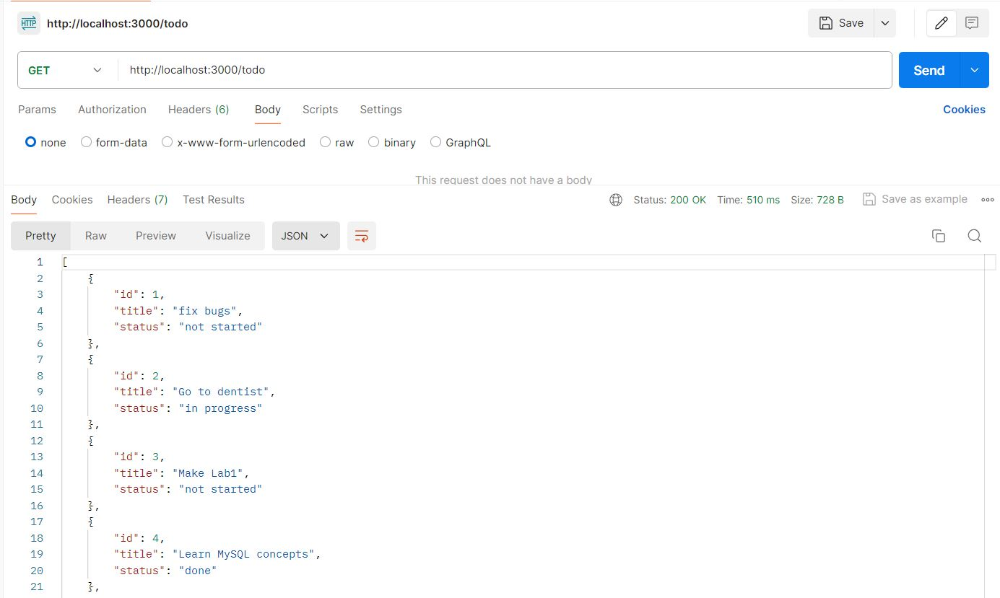
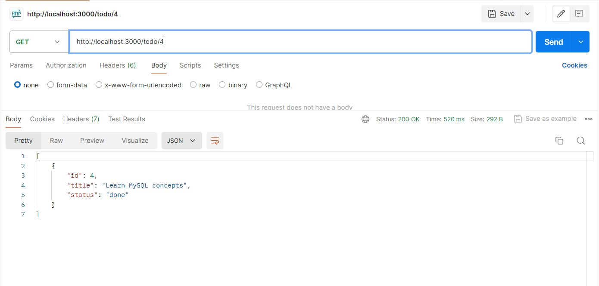
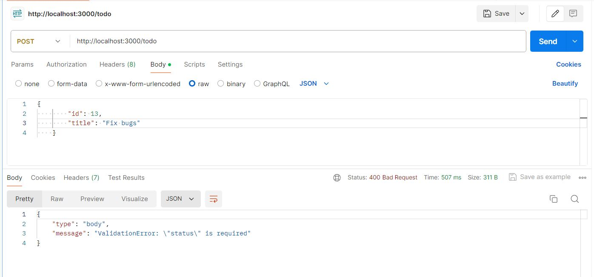
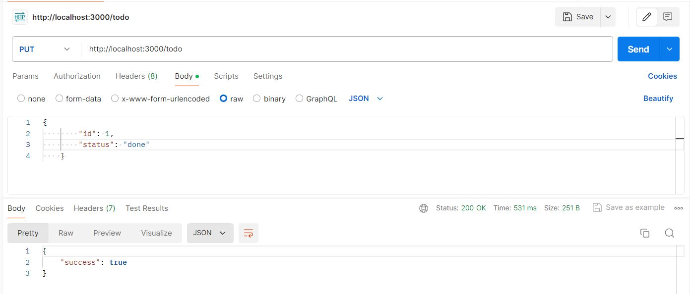
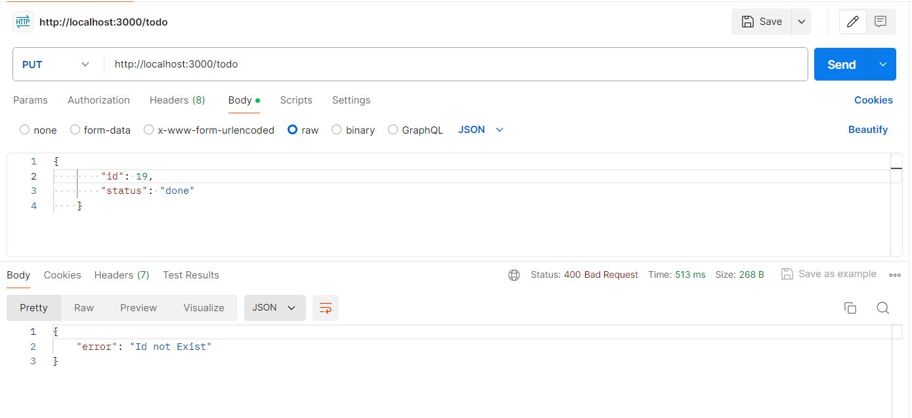
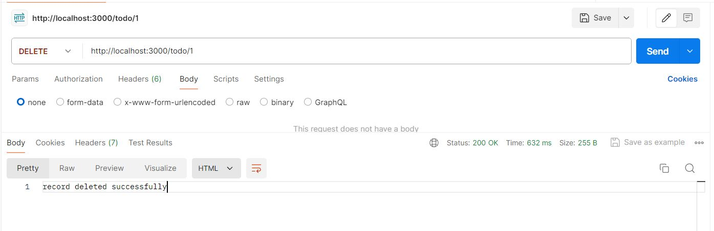

# Node.js To-Do App

A simple to-do list application built with Node.js, Express, and MySQL.

## Screenshots



---


---


---


---


---


---


## Installation

1. Clone the repository:
    ```sh
    git clone https://github.com/Esraa-GamalH/RequestsUsingNodeJS.git
    ```
2. Navigate to the project directory:
    ```sh
    cd RequestsUsingNodeJS
    ```
3. Install dependencies:
    ```sh
    npm install
    ```
4. Set up environment variables:
    ```sh
    cp .env.example .env
    ```
    Update the `.env` file with your MySQL database configuration.

## Usage
1. Start the development server:
    ```sh
    npm start
    ```
2. Open your browser and navigate to `http://localhost:3000`.

## Features

- Create, read, update, and delete to-do items
- Filter to-do items by id

## Contact

- GitHub: [Esraa-GamalH](https://github.com/Esraa-GamalH)
- Email: esr.gamal@nu.edu.eg
